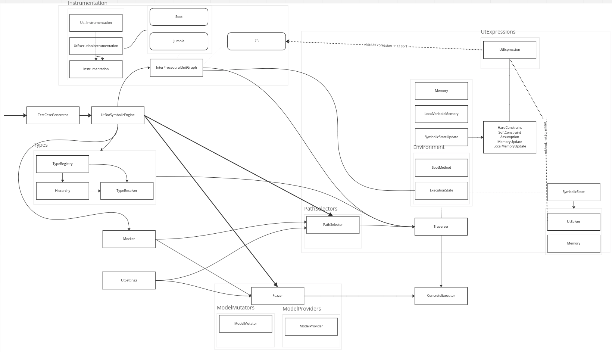

# cyber-utbot-api
## Abstract

[UTBot](https://github.com/UnitTestBot/UTBotJava) - UnitTestBot is the tool for automated unit test generation and precise code analysis.

`cyber-utbot-api` - обёртка над `utbot`, позволяющая запускать его из кода.

Она работает по аналогии с `utbot-cli`, в ней отдельно вынесены настройки для `cli`, можно задать настройки самого `utbot` внутри.

## Build

```bash
git clone https://github.com/UnitTestBot/UTBotJava
cd UTBotJava/
git checkout fe0b89c789da5559bf8912e0179cdcee026e6137
git clone https://github.com/cyberok-org/cyber-utbot-api
```

После стоит открыть `ide` и попытаться собрать. Потом приминить `patch` командной ниже и ещё раз собрать.

```bash
cd cyber-utbot-api/scripts/
bash patch_apply.sh
```

Дальше всё собирается командой (есть внутренние тесты для примеров которые и должны падать)

```gradle
gradle build -x test
```

## Run

[Application](src/main/kotlin/org/cyber/utbot/Application.kt) - `main` с которого можно из кода запускать `utbot`.

Другой способ, возможно более удобный, делать это через тесты - [Generator](src/test/kotlin/Generator.kt).

[ConstraintsViewer](src/test/kotlin/ConstraintsViewer.kt) - использовался внутри для генерации тестов, оставлен для удобства, аналогичен `Generator`.

## Docs

[brief](src/docs/brief.md) - доки по всему. Там есть описания для:
- `cyber-utbot-api` - в основном по настройкам. Не все из них проверены, но их корректность равносильна корректности `utbot-cli`.
- `utbot` - внутренние доки по `utbot`.
- `abstract` - тут что-то отдельное, не относящаяся к теме, но полезное при изучении.



Схема пока в таком виде, в дальнейшем может быть стоит расписать какие-то части подробнее и добавить формальную схему дополнительно к этой.

## Tests

[testcases](src/main/java/org/testcases) - папка с примерами (запускается на `utbot`).

[test](src/test/java/org/testcases) - папка с результатами запуска тестов.

[testcasesGen](src/main/java/org/testcasesGen) - папка c примерами в предполагаемом формате хранения. Спецификация формата хранения - [test format](src/docs/cyberok/test/TestFormatSpecification.md) (текущие примеры пока не удовлетворяют требованием спецификации).
