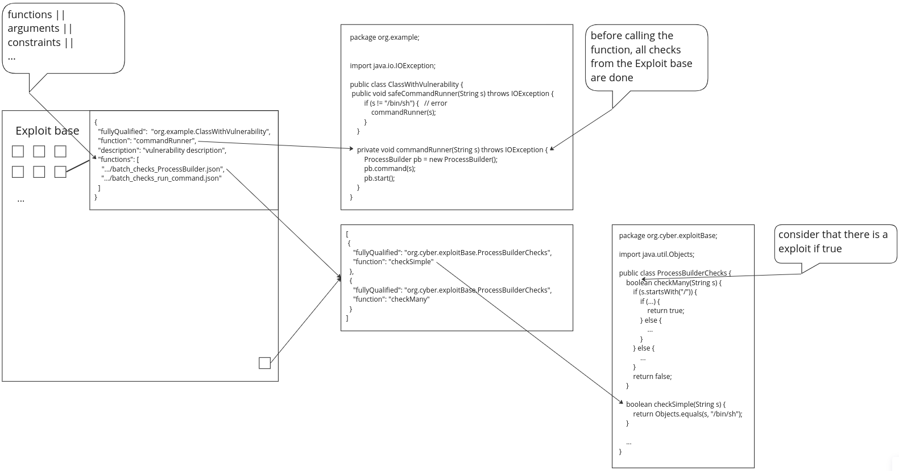
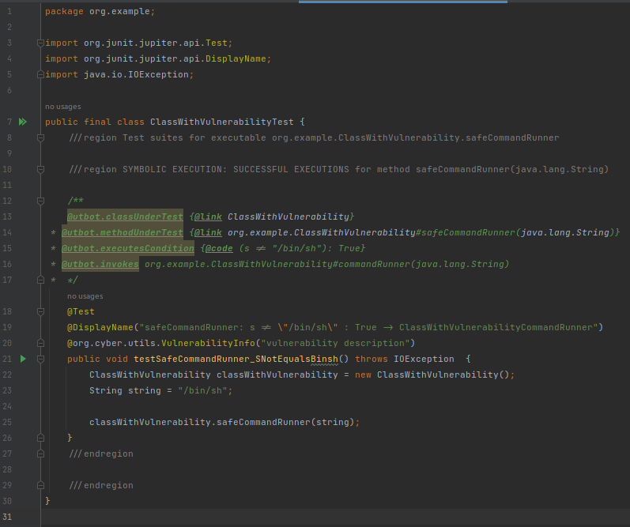

# VulnerabilityChecks

Проверка функции на уязвимость заключается в проверке её аргументов каким либо доступным способом (выполнение проверочной функции, возвращающей **true**, если она нашла уязвимость; сравнение аргументов с чем-то из базы и прочее)

Есть база уязвимостей, в ней хранятся все представленные данные (это вполне может быть несколько разных мест) и в целом способ хранения никак это не ограничивает.

Изначально есть множество json в формате [vulnerability_standard](utils/vulnerability_standard.json). Подробнее о нём и его частях в [VulnerabilityStandard](./VulnerabilityStandard.md). Они анализируются и наполняют базу уязвимостей, которая будет проверяться. При запуске указывается список мест которые анализируются (**vulnerabilityCheckDirectories** в [GenerateTestsSettings](../../../../src/main/kotlin/org/cyber/utbot/api/GenerateTestsSettings.kt)). 

Далее отдельно разбирается принцип работы с [functions](utils/vulnerability_functions_standard.json).

Из них набирается информация о том какие функции проверяются и если исполнение дошло до них - подгружается информация из соответствующих json и проверяемая функция декорируется. Это происходит через **soot** в **runtime**.

В итоге вместо функции f(x) выполняется следующее:

```
if (Check1.f(x)) {
    assert(Check1.description)
} else if (Check2.f(x)) {
    assert(Check2.description)
} else if (
    ...
} else {
    f(x)
}
```

Где **f** - проверяемая функция, **x** - её аргументы, **Check{x}** - какая-то сущность, содержащая всё необходимое для проверки и информировании об уязвимости функции **f**, полученная из базы уязвимостей. **Check{x}.f** - какая-то проверка **f**, **Check{}.description** - описания уязвимости для этой проверки.

UTBot пытается пройти везде и в итоге генерируются тесты, когда проходят проверки (т.е. находится уязвимость). Эти тесты аннотируются описанием из [vulnerability_standard](utils/vulnerability_standard.json). Остальные тесты отбрасываются по умолчанию (**onlyVulnerabilities** в [GenerateTestsSettings](../../../../src/main/kotlin/org/cyber/utbot/api/GenerateTestsSettings.kt)).

Картинка о том как это лежит и что на что ссылается.



И в итоге генерируется такой тест



### Структура

[functions](utils/vulnerability_functions_standard.json) и остальные (аналогичные json того же уровня ([arguments](utils/vulnerability_argumetns_standard.json), [constraints](utils/vulnerability_constraints_standard.json)) отделены от основного [vulnerability_standard](utils/vulnerability_standard.json) по ряду причин:

- они имеют разный вид и правильно их выделять в отдельные структуры
- их можно подгружать лениво (как это и происходит)
- их можно переиспользовать. Несколько функций могут иметь одинаковые уязвимости и для них можно использовать один файл с проверками вместо перечисления самих проверок.

### Замечания

Пока что проверка для функций **Check{x}** выше - это проверка по каждому "fullyQualified" и "function" из файла [functions](utils/vulnerability_functions_standard.json). Потом планируется переделать её в проверку по всему файлу [functions](utils/vulnerability_functions_standard.json) или вообще по [vulnerability_standard](utils/vulnerability_standard.json), чтобы не генерировалось избыточное количество однотипных тестов.
