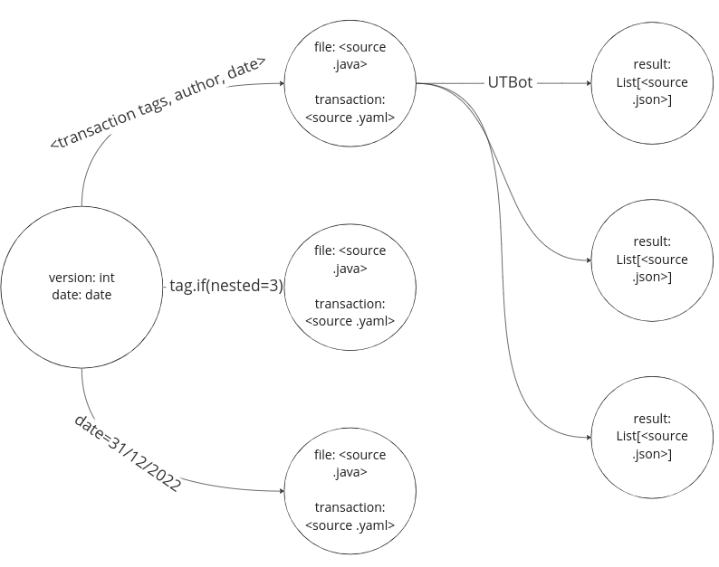
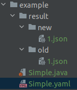
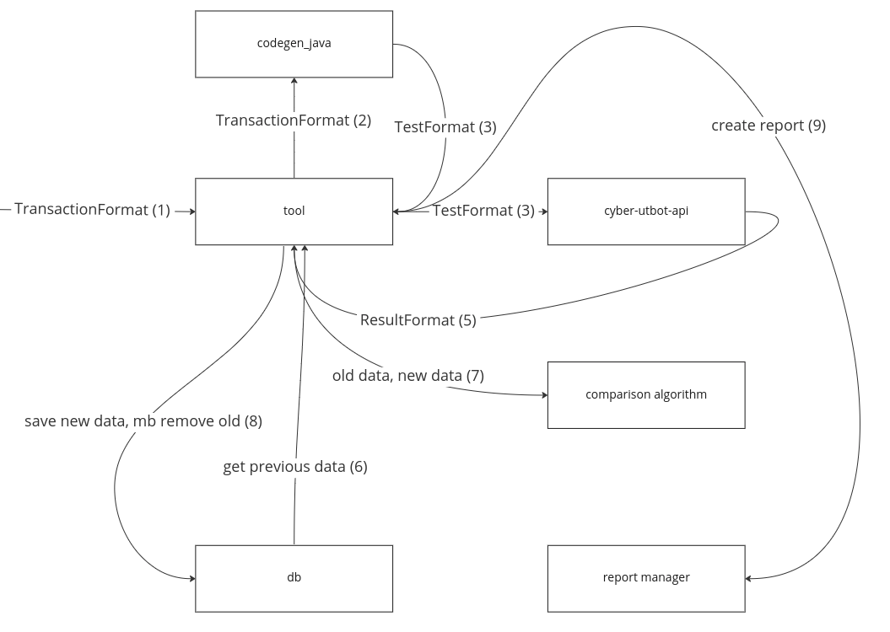
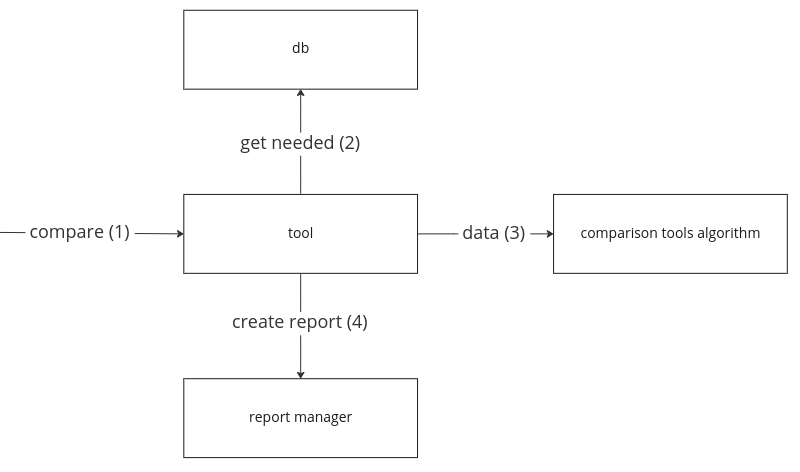

# Test format specification

## Reason

Тесты достаточно важны для текущей задачи:
- можно сравнивать впоследствии с, например, другими движками
- можно увидеть что изменилось при обновлении проекта
- мониторить ошибки и вовремя узнать, что их исправили или понять, что где-то наоборот всё сломалось
- позволяют понять как всё работает

## Characteristics

Хочется, чтобы формат был (ожидаемые свойства):
- **понятным** (не слишком сложным в понимании и интерпретации, можно легко добавить экземпляр)
- **анализируемым** (поскольку впоследствии на нём можно будет смотреть метрики, запускать что-то)
- **удобным** (есть способы поиска, фильтрации)
- **воспроизводимым** (можно понять как был получен прошлый результат и получить его заново. Это свойство необходимо с учётом предложенного решения, т.к. оно, в том числе полагается на результаты запуска используемых инструментов)
- **адаптируемым** (есть возможность немного поменять параметры и получить похожее. Полагается на предложенное решение. Нужно в основном для генерации и упрощения найденного ответа, что бы это не значило)
- **экономичным** (занимает не слишком много места)
- **надёжным** (нельзя каким либо образом сломать консистентность формата)

## Main part

Сам формат строится из компонентов трёх типов:
- [TestFormat](TestFormat.md) - тестовый файл, который можно передать инструменту для обработки (упрощённо `java` файл с одним тестируемым классом)
- [TransactionFormat](TransactionFormat.md) - файл с настройками для генерации [TestFormat](TestFormat.md) (упрощённо `yaml` файл специального вида, позволяющий понять информацию о самом примере и сгенерить его)
- [ResultFormat](ResultFormat.md) - результат запуска конкретного инструмента в обобщённом виде (для последующего сравнения и аналитики)

## Checking the characteristics

Пусть есть приложение (будем называть его `tool` для простоты), которое умеет работать с генератором, api инструментов (UTBot, ...), умеет хранить какую-то структуру из компонентов, описанных выше и содержит алгоритмы для сравнения разных запуском и разных инструментов. Позже установим, как оно устроено

### Понятность
Каждый из форматов имеет понятный вид, есть две схемы для добавления:
- сделать файл [TransactionFormat](TransactionFormat.md) и отдать его `tool`. Он сделает файл [TestFormat](TestFormat.md) с помощью генератора, прогонит на нём инструменты, получит и сохранит всё это
- сделать файлы [TestFormat](TestFormat.md) и [TransactionFormat](TransactionFormat.md) (ручной пример, есть метка о том что он не сгенерирован). Дальше, как и в другом варианте

### Анализируемость
Есть за счёт [ResultFormat](ResultFormat.md) и алгоритмов `tool`

### Удобство
Есть за счёт [TransactionFormat](TransactionFormat.md), так же стоит потребовать его от `tool`

### Воспроизводимость
Для тестов должно быть завязано на хранение у `tool`. Для генератора так же хочется воспроизводимости - для этого есть `random seed` в [TransactionFormat](TransactionFormat.md)

### Адаптируемость
[TransactionFormat](TransactionFormat.md), в том числе является входом для генератора, можно сделать копию и немного поменять параметры, получить похожий результат

### Экономичность
Стоит требовать от структуры хранения `tool`

### Надёжность
Стоит требовать от api `tool` и его внутренних процессов 

## Tool concept

Пусть у нас есть алгоритмы для сравнения разных запусков и разных инструментов. Будем считать, что внутренняя часть со взаимодействием понятно как устроена. API продумывать рано.

Для начала определимся со структурой. Хотим хранить [TestFormat](TestFormat.md) и [TransactionFormat](TransactionFormat.md) вместе и связывать их со списком (формат определяет один тест, их может быть несколько) [ResultFormat](ResultFormat.md) для каждого инструмента

Стоит помнить [ResultFormat](ResultFormat.md) только для последнего запуска. Потому что в любой момент мы либо хотим сравнить то, что получилось сейчас с тем что хранится или просто получить, что есть

Будем хранить всё в бд (в качестве бд возьмём [neo4j](https://neo4j.com/) - nosql db с удобным языком поиска и визуализацией), посмотрим какие от этого плюсы (сразу предполагая [neo4j](https://neo4j.com/)), но сначала зададим формат:



Есть `node` с версией и временем, он постоянный для какого-то запуска. После следующего запуска текущий удаляется в общем случае.

С ним по тегам и прочему связаны `node`, хранящие [TransactionFormat](TransactionFormat.md) и [TestFormat](TestFormat.md). И уже они связаны с результатом запуска на конкретном инструменте (списком [ResultFormat](ResultFormat.md))

При запуске всего (тут надо продумать более детально параметры и конкретные запросы, да и это обрабатывать не так банально) создастся новая начальная `node`. К ней по тегам и прочему прикрепляется тестируемые части. Запускается инструменты и получаются остальные `node` с результатами. После этого сравнивается предыдущий результат запуска с текущим с помощью алгоритма, если ничего значимого не произошло - предыдущий результат удаляется. Если что-то поменялось эта часть остаётся храниться (может архивироваться потом) и об этом составляется отчёт.

Посмотрим, что мы получили с такой репрезентацией:
- алгоритмы дают `анализируемость` (мы их запускаем при обновлении хранимых данных, можем запускать для разных инструментов в любой момент, т.к. храним последние версии запуска)
- `удобство` есть даже на уровне бд. Какая-то обёртка всё равно пригодиться, но будут сразу же гарантии скорости и корректности. Хранится в точности то, что нам надо по рёбрам, можно легко отфильтровать и даже визуализировать немного
- `воспроизводимость` есть потому, что мы храним файл и "параметры для генератора" и можем ими воспользоваться
- `экономичность` есть, т.к. мы храним не больше, чем нам нужно, к тому же вообще в бд
- `надёжность` можно гарантировать за счёт продуманного апи в дальнейшем (выполняем только добавление всего - не можем повредить какую-то часть). Можно сделать периодическую валидацию формата для ручных тестов (но это опционально)

За счёт такого представления мы получили все необходимые свойства выше.

При получении значимого отличия результатов алгоритмов `tool` может создавать директорию такого вида (для последующего анализа), [например](example): 



И, наконец, абстрактная неформальная схема работы `tool` в случае обновления данных



И в случае сравнения алгоритмов



## Tests generation realization

[//]: #TODO (Tests generation realization)

Пока `tool` не реализован. [ResultFormat](ResultFormat.md) можно получить только в более простом виде и неудобно - берётся копированием из консоли результата запуска `cyber-utbot-api` (с предварительными изменениями, описанными ниже)

Изменение для вывода - стоит добавить в начало [UtBotSymbolicEngine](../../../../../utbot-framework/src/main/kotlin/org/utbot/engine/UtBotSymbolicEngine.kt) `consumeTerminalState`:

```kotlin
println("----------------------------------------------------------------------------------------------------")
println("path: ${state.path.joinToString(separator=",\n\t")}")
state.symbolicState.solver.apply {
    println("assertions: ${assertions.joinToString(separator=",\n\t")}")
    println("assumption: $assumption")
    println("lastStatus: $lastStatus")
}
println()
```
